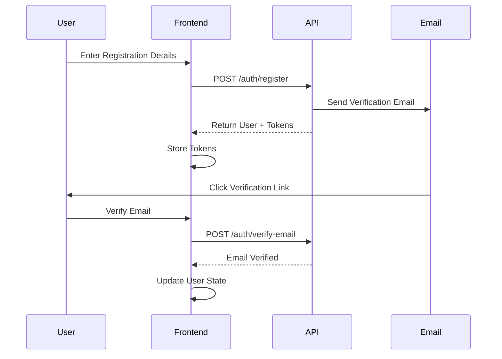

# 🎨 OrderEats API Specification
### Frontend Integration & UI/UX Design Guide

This document provides complete API specifications for **Frontend Developers** and **UI/UX Designers** working on the OrderEats platform.

---

## 📋 Table of Contents

1. [Getting Started](#-getting-started)
2. [Authentication Flow](#-authentication-flow)
3. [API Endpoints Reference](#-api-endpoints-reference)
4. [Data Models](#-data-models)
5. [UI/UX Guidelines](#-uiux-guidelines)
6. [Error Handling](#-error-handling)
7. [Code Examples](#-code-examples)

---

## 🚀 Getting Started

### Base URL
```
Development: http://localhost:5000/api/v1
Production: https://api.ordereeats.com/api/v1
```

### Request Headers
```javascript
{
  "Content-Type": "application/json",
  "Authorization": "Bearer <access_token>" // For protected routes
}
```

### Response Format
All API responses follow this structure:

**Success Response:**
```json
{
  "success": true,
  "message": "Operation successful",
  "data": { /* Your data here */ }
}
```

**Error Response:**
```json
{
  "success": false,
  "message": "Error message",
  "errorMessages": [
    {
      "path": "fieldName",
      "message": "Specific error"
    }
  ]
}
```

---

## 🔐 Authentication Flow

### User Registration & Login Flow



### 1. Register New User

**Endpoint:** `POST /auth/register`

**Request Body:**
```json
{
  "name": "John Doe",
  "email": "john@example.com",
  "password": "SecurePass123!",
  "role": "CUSTOMER" // CUSTOMER | PROVIDER | ADMIN
}
```

**Response:**
```json
{
  "success": true,
  "message": "User registered successfully",
  "data": {
    "user": {
      "id": "cm4abc123",
      "name": "John Doe",
      "email": "john@example.com",
      "role": "CUSTOMER",
      "isEmailVerified": false,
      "createdAt": "2026-02-01T12:00:00.000Z"
    },
    "accessToken": "eyJhbGciOiJIUzI1NiIsInR5cCI6IkpXVCJ9...",
    "refreshToken": "eyJhbGciOiJIUzI1NiIsInR5cCI6IkpXVCJ9..."
  }
}
```

**UI/UX Considerations:**
- Show password strength indicator
- Display validation errors inline
- Show success message and redirect to email verification page
- Auto-login after successful registration

---

### 2. Login User

**Endpoint:** `POST /auth/login`

**Request Body:**
```json
{
  "email": "john@example.com",
  "password": "SecurePass123!"
}
```

**Response:** (Same as registration)

**UI/UX Considerations:**
- Remember me checkbox (store refresh token securely)
- "Forgot Password?" link
- Show loading state during authentication
- Redirect based on user role:
  - `CUSTOMER` → Home/Menu page
  - `PROVIDER` → Provider Dashboard
  - `ADMIN` → Admin Panel

---

### 3. Refresh Access Token

**Endpoint:** `POST /auth/refresh`

**Request Body:**
```json
{
  "refreshToken": "eyJhbGciOiJIUzI1NiIsInR5cCI6IkpXVCJ9..."
}
```

**Response:**
```json
{
  "success": true,
  "message": "Access token refreshed successfully",
  "data": {
    "accessToken": "new_access_token_here"
  }
}
```

**Implementation Note:**
- Call this endpoint when you receive a 401 error
- Automatically refresh token before expiry
- If refresh fails, logout user and redirect to login

---

### 4. Verify Email

**Endpoint:** `POST /auth/verify-email`

**Request Body:**
```json
{
  "token": "verification_token_from_email"
}
```

**UI/UX Considerations:**
- Show email verification pending banner
- Resend verification email option
- Success animation after verification

---

### 5. Forgot Password

**Endpoint:** `POST /auth/forgot-password`

**Request Body:**
```json
{
  "email": "john@example.com"
}
```

**UI/UX Considerations:**
- Show "Email sent" confirmation
- Provide support contact if email not received

---

### 6. Reset Password

**Endpoint:** `POST /auth/reset-password`

**Request Body:**
```json
{
  "token": "reset_token_from_email",
  "newPassword": "NewSecurePass123!"
}
```

---

## 📡 API Endpoints Reference

### 🍱 Meals Module

#### Get All Meals

**Endpoint:** `GET /meals`

**Query Parameters:**
```javascript
{
  category?: string,      // Filter by category ID
  provider?: string,      // Filter by provider ID
  search?: string,        // Search in name/description
  minPrice?: number,      // Minimum price
  maxPrice?: number,      // Maximum price
  available?: boolean,    // Only available meals
  page?: number,          // Pagination (default: 1)
  limit?: number          // Items per page (default: 10)
}
```

**Example Request:**
```
GET /meals?category=cm4cat1&minPrice=100&maxPrice=500&page=1&limit=20
```

**Response:**
```json
{
  "success": true,
  "message": "Meals retrieved successfully",
  "data": [
    {
      "id": "cm4meal1",
      "name": "Chicken Burger",
      "description": "Juicy grilled chicken with fresh veggies",
      "price": 250.00,
      "image": "https://example.com/images/burger.jpg",
      "available": true,
      "category": {
        "id": "cm4cat1",
        "name": "Fast Food"
      },
      "provider": {
        "id": "cm4prov1",
        "name": "Burger House",
        "location": "Dhaka, Bangladesh"
      },
      "rating": 4.5,
      "reviewCount": 120
    }
  ],
  "meta": {
    "page": 1,
    "limit": 20,
    "total": 150
  }
}
```

**UI Components Needed:**
- Meal card with image, name, price, rating
- Filter sidebar (category, price range, provider)
- Search bar
- Pagination controls
- "Add to Cart" button

---

#### Get Single Meal

**Endpoint:** `GET /meals/:id`

**Response:**
```json
{
  "success": true,
  "message": "Meal retrieved successfully",
  "data": {
    "id": "cm4meal1",
    "name": "Chicken Burger",
    "description": "Juicy grilled chicken with fresh veggies",
    "price": 250.00,
    "image": "https://example.com/images/burger.jpg",
    "available": true,
    "category": {
      "id": "cm4cat1",
      "name": "Fast Food",
      "description": "Quick and tasty meals"
    },
    "provider": {
      "id": "cm4prov1",
      "name": "Burger House",
      "description": "Best burgers in town",
      "location": "Dhaka, Bangladesh",
      "phone": "+880123456789",
      "image": "https://example.com/providers/burger-house.jpg"
    },
    "reviews": [
      {
        "id": "cm4rev1",
        "rating": 5,
        "comment": "Absolutely delicious!",
        "user": {
          "name": "Sarah Khan"
        },
        "createdAt": "2026-01-28T10:30:00.000Z"
      }
    ]
  }
}
```

**UI Components Needed:**
- Hero image section
- Detailed description
- Price display
- Add to cart with quantity selector
- Reviews section with ratings
- Provider info card
- Related meals carousel

---

### 🛒 Cart Module

#### Get User's Cart

**Endpoint:** `GET /cart`  
**Authentication:** Required

**Response:**
```json
{
  "success": true,
  "message": "Cart retrieved successfully",
  "data": {
    "id": "cm4cart1",
    "items": [
      {
        "id": "cm4item1",
        "quantity": 2,
        "meal": {
          "id": "cm4meal1",
          "name": "Chicken Burger",
          "price": 250.00,
          "image": "https://example.com/images/burger.jpg",
          "available": true,
          "provider": {
            "name": "Burger House"
          }
        },
        "subtotal": 500.00
      }
    ],
    "totalItems": 2,
    "totalPrice": 500.00,
    "createdAt": "2026-02-01T09:00:00.000Z",
    "updatedAt": "2026-02-01T12:30:00.000Z"
  }
}
```

**UI Components Needed:**
- Cart icon with item count badge
- Cart drawer/modal
- Item list with image, name, quantity controls
- Remove item button
- Subtotal per item
- Total price display (large, prominent)
- "Proceed to Checkout" button
- Empty cart state

---

#### Add Item to Cart

**Endpoint:** `POST /cart/items`  
**Authentication:** Required

**Request Body:**
```json
{
  "mealId": "cm4meal1",
  "quantity": 2
}
```

**UI/UX Considerations:**
- Show success toast notification
- Update cart badge count
- Animate cart icon (shake or bounce)
- Disable button if item already in cart or unavailable

---

#### Update Cart Item

**Endpoint:** `PATCH /cart/items/:itemId`  
**Authentication:** Required

**Request Body:**
```json
{
  "quantity": 3
}
```

**UI/UX Considerations:**
- Instant quantity update with +/- buttons
- Debounce API calls (wait 500ms after user stops clicking)
- Show loading state on quantity selector
- Auto-update total price

---

#### Remove Cart Item

**Endpoint:** `DELETE /cart/items/:itemId`  
**Authentication:** Required

**UI/UX Considerations:**
- Confirmation dialog ("Remove this item?")
- Undo option (5-second timeout)
- Smooth removal animation

---

#### Get Cart Total

**Endpoint:** `GET /cart/total`  
**Authentication:** Required

**Response:**
```json
{
  "success": true,
  "data": {
    "total": 500.00
  }
}
```

---

#### Clear Cart

**Endpoint:** `DELETE /cart`  
**Authentication:** Required

**UI/UX Considerations:**
- Confirmation dialog ("Clear all items?")
- Only show when cart has items

---

### 🛍️ Orders Module

#### Create Order

**Endpoint:** `POST /orders`  
**Authentication:** Required (CUSTOMER role)

**Request Body:**
```json
{
  "deliveryAddress": "123 Main Street, Dhaka 1205",
  "paymentMethod": "CASH_ON_DELIVERY", // CASH_ON_DELIVERY | ONLINE
  "promoCode": "SAVE20" // Optional
}
```

**Response:**
```json
{
  "success": true,
  "message": "Order placed successfully",
  "data": {
    "id": "cm4order1",
    "orderNumber": "ORD-20260201-001",
    "totalAmount": 400.00,
    "discount": 100.00,
    "finalAmount": 400.00,
    "status": "PENDING",
    "deliveryAddress": "123 Main Street, Dhaka 1205",
    "paymentMethod": "CASH_ON_DELIVERY",
    "items": [
      {
        "id": "cm4orderitem1",
        "quantity": 2,
        "price": 250.00,
        "meal": {
          "name": "Chicken Burger",
          "image": "https://example.com/images/burger.jpg"
        }
      }
    ],
    "promoCode": {
      "code": "SAVE20",
      "discountValue": 100.00
    },
    "createdAt": "2026-02-01T13:00:00.000Z",
    "estimatedDelivery": "2026-02-01T14:30:00.000Z"
  }
}
```

**UI/UX Flow:**
1. **Checkout Page:**
   - Cart summary (read-only)
   - Delivery address form (with save option)
   - Promo code input
   - Payment method selector
   - Order total breakdown
   - "Place Order" button

2. **Order Confirmation Page:**
   - Order number (large, copyable)
   - Success animation
   - Order summary
   - Estimated delivery time
   - "Track Order" button
   - "View Order Details" button

---

#### Get User Orders

**Endpoint:** `GET /orders`  
**Authentication:** Required

**Query Parameters:**
```javascript
{
  status?: "PENDING" | "CONFIRMED" | "PREPARING" | "DELIVERED" | "CANCELLED",
  page?: number,
  limit?: number
}
```

**Response:**
```json
{
  "success": true,
  "message": "Orders retrieved successfully",
  "data": [
    {
      "id": "cm4order1",
      "orderNumber": "ORD-20260201-001",
      "totalAmount": 400.00,
      "status": "CONFIRMED",
      "createdAt": "2026-02-01T13:00:00.000Z",
      "items": [
        {
          "meal": {
            "name": "Chicken Burger",
            "image": "https://example.com/images/burger.jpg"
          },
          "quantity": 2
        }
      ]
    }
  ],
  "meta": {
    "page": 1,
    "limit": 10,
    "total": 25
  }
}
```

**UI Components Needed:**
- Order history list
- Status badge (color-coded)
- Order card with image, items count, total
- Filter by status tabs
- "Reorder" button for delivered orders
- "Track Order" button for active orders

---

#### Get Single Order

**Endpoint:** `GET /orders/:id`  
**Authentication:** Required

**Response:**
```json
{
  "success": true,
  "message": "Order retrieved successfully",
  "data": {
    "id": "cm4order1",
    "orderNumber": "ORD-20260201-001",
    "status": "CONFIRMED",
    "totalAmount": 400.00,
    "deliveryAddress": "123 Main Street, Dhaka 1205",
    "paymentMethod": "CASH_ON_DELIVERY",
    "items": [
      {
        "id": "cm4orderitem1",
        "quantity": 2,
        "price": 250.00,
        "meal": {
          "id": "cm4meal1",
          "name": "Chicken Burger",
          "image": "https://example.com/images/burger.jpg",
          "provider": {
            "name": "Burger House",
            "phone": "+880123456789"
          }
        }
      }
    ],
    "user": {
      "name": "John Doe",
      "email": "john@example.com"
    },
    "createdAt": "2026-02-01T13:00:00.000Z",
    "updatedAt": "2026-02-01T13:15:00.000Z"
  }
}
```

**UI Components Needed:**
- Order timeline/stepper (Pending → Confirmed → Preparing → Delivered)
- Item list with images
- Delivery address display
- Contact provider button
- Download invoice button
- Cancel order button (if pending)

---

### 🎟️ Promo Codes Module

#### Get Active Promo Codes

**Endpoint:** `GET /promo-codes/active`  
**Authentication:** Public

**Response:**
```json
{
  "success": true,
  "message": "Active promo codes retrieved",
  "data": [
    {
      "id": "cm4promo1",
      "code": "SAVE20",
      "discountType": "PERCENTAGE",
      "discountValue": 20,
      "minOrderAmount": 200,
      "expiresAt": "2026-02-28T23:59:59.000Z",
      "description": "Get 20% off on orders above ৳200"
    }
  ]
}
```

**UI Components Needed:**
- Promo code banner/carousel on home page
- "Available Offers" page
- Promo card with code (click to copy)
- Expiry date display
- Minimum order requirement

---

#### Validate Promo Code

**Endpoint:** `POST /promo-codes/:code/validate`  
**Authentication:** Required (CUSTOMER role)

**Request Body:**
```json
{
  "orderTotal": 500.00
}
```

**Response:**
```json
{
  "success": true,
  "message": "Promo code is valid",
  "data": {
    "code": "SAVE20",
    "discountType": "PERCENTAGE",
    "discountValue": 20,
    "discountAmount": 100.00,
    "finalAmount": 400.00
  }
}
```

**Error Response (Invalid Code):**
```json
{
  "success": false,
  "message": "Promo code validation failed",
  "errorMessages": [
    {
      "path": "code",
      "message": "Promo code has expired"
    }
  ]
}
```

**UI/UX Considerations:**
- Input field with "Apply" button
- Show loading state while validating
- Success: Show discount amount in green
- Error: Show error message in red
- "Remove" button after applied

---

### ⭐ Reviews Module

#### Create Review

**Endpoint:** `POST /reviews`  
**Authentication:** Required (CUSTOMER role)

**Request Body:**
```json
{
  "mealId": "cm4meal1",
  "rating": 5,
  "comment": "Absolutely delicious! Highly recommend."
}
```

**UI Components Needed:**
- Star rating selector (interactive)
- Comment textarea
- Submit button
- Show only for delivered orders
- One review per meal per user

---

### 📂 Categories Module

#### Get All Categories

**Endpoint:** `GET /categories`  
**Authentication:** Public

**Response:**
```json
{
  "success": true,
  "message": "Categories retrieved successfully",
  "data": [
    {
      "id": "cm4cat1",
      "name": "Fast Food",
      "description": "Quick and tasty meals",
      "icon": "🍔",
      "mealCount": 45
    },
    {
      "id": "cm4cat2",
      "name": "Desserts",
      "description": "Sweet treats",
      "icon": "🍰",
      "mealCount": 28
    }
  ]
}
```

**UI Components Needed:**
- Category chips/pills for filtering
- Category grid on home page
- Category icon + name
- Meal count badge

---

### 🏪 Providers Module

#### Get All Providers

**Endpoint:** `GET /providers`  
**Authentication:** Public

**Response:**
```json
{
  "success": true,
  "message": "Providers retrieved successfully",
  "data": [
    {
      "id": "cm4prov1",
      "name": "Burger House",
      "description": "Best burgers in town since 2015",
      "location": "Dhaka, Bangladesh",
      "phone": "+880123456789",
      "image": "https://example.com/providers/burger-house.jpg",
      "rating": 4.7,
      "mealCount": 24,
      "isActive": true
    }
  ]
}
```

**UI Components Needed:**
- Provider card with image, name, rating
- Location icon + text
- "View Menu" button
- Featured providers section

---

#### Get Provider Details

**Endpoint:** `GET /providers/:id`  
**Authentication:** Public

**Response:**
```json
{
  "success": true,
  "message": "Provider retrieved successfully",
  "data": {
    "id": "cm4prov1",
    "name": "Burger House",
    "description": "Best burgers in town since 2015",
    "location": "Dhaka, Bangladesh",
    "phone": "+880123456789",
    "image": "https://example.com/providers/burger-house.jpg",
    "rating": 4.7,
    "meals": [
      {
        "id": "cm4meal1",
        "name": "Chicken Burger",
        "price": 250.00,
        "image": "https://example.com/images/burger.jpg",
        "rating": 4.8
      }
    ]
  }
}
```

---

## 📊 Data Models

### User Model
```typescript
interface User {
  id: string;
  name: string;
  email: string;
  role: "CUSTOMER" | "PROVIDER" | "ADMIN";
  isEmailVerified: boolean;
  createdAt: string; // ISO 8601 format
  updatedAt: string;
}
```

### Meal Model
```typescript
interface Meal {
  id: string;
  name: string;
  description: string;
  price: number;
  image: string;
  available: boolean;
  category: Category;
  provider: Provider;
  rating?: number;
  reviewCount?: number;
  createdAt: string;
  updatedAt: string;
}
```

### Cart Model
```typescript
interface Cart {
  id: string;
  items: CartItem[];
  totalItems: number;
  totalPrice: number;
  createdAt: string;
  updatedAt: string;
}

interface CartItem {
  id: string;
  quantity: number;
  meal: Meal;
  subtotal: number;
}
```

### Order Model
```typescript
interface Order {
  id: string;
  orderNumber: string;
  totalAmount: number;
  discount?: number;
  finalAmount: number;
  status: OrderStatus;
  deliveryAddress: string;
  paymentMethod: "CASH_ON_DELIVERY" | "ONLINE";
  items: OrderItem[];
  user: User;
  promoCode?: PromoCode;
  createdAt: string;
  updatedAt: string;
}

type OrderStatus = "PENDING" | "CONFIRMED" | "PREPARING" | "DELIVERED" | "CANCELLED";

interface OrderItem {
  id: string;
  quantity: number;
  price: number;
  meal: Meal;
}
```

### PromoCode Model
```typescript
interface PromoCode {
  id: string;
  code: string;
  discountType: "PERCENTAGE" | "FIXED";
  discountValue: number;
  minOrderAmount: number;
  maxUses?: number;
  currentUses: number;
  expiresAt: string;
  isActive: boolean;
}
```

---

## 🎨 UI/UX Guidelines

### Color Palette Recommendations

```css
/* Primary Colors */
--primary: #FF6B35;      /* Main brand color (Orange) */
--primary-dark: #E85A2A;
--primary-light: #FF8C5C;

/* Secondary Colors */
--secondary: #004E89;    /* Deep Blue */
--secondary-dark: #003D6B;
--secondary-light: #1A6BA8;

/* Status Colors */
--success: #2ECC71;      /* Green - for success messages */
--warning: #F39C12;      /* Yellow - for warnings */
--error: #E74C3C;        /* Red - for errors */
--info: #3498DB;         /* Blue - for info */

/* Neutral Colors */
--text-primary: #2C3E50;
--text-secondary: #7F8C8D;
--background: #FFFFFF;
--background-secondary: #F8F9FA;
--border: #E0E0E0;
```

### Typography

```css
/* Font Family */
font-family: 'Inter', -apple-system, BlinkMacSystemFont, 'Segoe UI', sans-serif;

/* Font Sizes */
--text-xs: 12px;
--text-sm: 14px;
--text-base: 16px;
--text-lg: 18px;
--text-xl: 20px;
--text-2xl: 24px;
--text-3xl: 30px;
--text-4xl: 36px;

/* Font Weights */
--font-regular: 400;
--font-medium: 500;
--font-semibold: 600;
--font-bold: 700;
```

### Spacing System

```css
--spacing-1: 4px;
--spacing-2: 8px;
--spacing-3: 12px;
--spacing-4: 16px;
--spacing-5: 20px;
--spacing-6: 24px;
--spacing-8: 32px;
--spacing-10: 40px;
--spacing-12: 48px;
```

### Component Design Guidelines

#### Buttons

**Primary Button:**
```css
.btn-primary {
  background: var(--primary);
  color: white;
  padding: 12px 24px;
  border-radius: 8px;
  font-weight: 600;
  transition: all 0.3s ease;
}

.btn-primary:hover {
  background: var(--primary-dark);
  transform: translateY(-2px);
  box-shadow: 0 4px 12px rgba(255, 107, 53, 0.3);
}
```

**Secondary Button:**
```css
.btn-secondary {
  background: white;
  color: var(--primary);
  border: 2px solid var(--primary);
  padding: 12px 24px;
  border-radius: 8px;
  font-weight: 600;
}
```

#### Cards

```css
.card {
  background: white;
  border-radius: 12px;
  padding: 20px;
  box-shadow: 0 2px 8px rgba(0, 0, 0, 0.08);
  transition: transform 0.3s ease, box-shadow 0.3s ease;
}

.card:hover {
  transform: translateY(-4px);
  box-shadow: 0 8px 24px rgba(0, 0, 0, 0.12);
}
```

#### Input Fields

```css
.input {
  width: 100%;
  padding: 12px 16px;
  border: 2px solid var(--border);
  border-radius: 8px;
  font-size: 16px;
  transition: border-color 0.3s ease;
}

.input:focus {
  border-color: var(--primary);
  outline: none;
  box-shadow: 0 0 0 3px rgba(255, 107, 53, 0.1);
}

.input.error {
  border-color: var(--error);
}
```

### Page Layouts

#### Home Page Structure
```
┌─────────────────────────────────────────┐
│            Header/Navbar                │
│   [Logo] [Search] [Cart] [User]        │
├─────────────────────────────────────────┤
│          Hero Banner                    │
│   "Order Your Favorite Food"            │
├─────────────────────────────────────────┤
│       Category Chips                    │
│   [Fast Food] [Desserts] [Drinks]      │
├─────────────────────────────────────────┤
│      Featured Providers                 │
│   [Provider Card] [Provider Card]       │
├─────────────────────────────────────────┤
│       Popular Meals Grid                │
│   [Meal] [Meal] [Meal] [Meal]          │
│   [Meal] [Meal] [Meal] [Meal]          │
├─────────────────────────────────────────┤
│       Active Promo Codes                │
│   [SAVE20] [FREESHIP]                   │
├─────────────────────────────────────────┤
│            Footer                       │
└─────────────────────────────────────────┘
```

#### Order Status Visualization

```javascript
const orderStatusSteps = {
  PENDING: {
    label: "Order Placed",
    color: "#F39C12",
    icon: "📝",
    description: "Your order has been placed"
  },
  CONFIRMED: {
    label: "Confirmed",
    color: "#3498DB",
    icon: "✅",
    description: "Restaurant confirmed your order"
  },
  PREPARING: {
    label: "Preparing",
    color: "#9B59B6",
    icon: "👨‍🍳",
    description: "Your food is being prepared"
  },
  DELIVERED: {
    label: "Delivered",
    color: "#2ECC71",
    icon: "🎉",
    description: "Enjoy your meal!"
  }
};
```

---

## ❌ Error Handling

### Common Error Scenarios

#### 1. Unauthorized (401)
```json
{
  "success": false,
  "message": "You are not authorized",
  "errorMessages": []
}
```
**UI Action:** Redirect to login page

#### 2. Forbidden (403)
```json
{
  "success": false,
  "message": "Forbidden",
  "errorMessages": []
}
```
**UI Action:** Show "Access Denied" message

#### 3. Not Found (404)
```json
{
  "success": false,
  "message": "Resource not found",
  "errorMessages": []
}
```
**UI Action:** Show 404 page

#### 4. Validation Error (400)
```json
{
  "success": false,
  "message": "Validation Error",
  "errorMessages": [
    {
      "path": "email",
      "message": "Invalid email format"
    },
    {
      "path": "password",
      "message": "Password must be at least 8 characters"
    }
  ]
}
```
**UI Action:** Show inline validation errors

#### 5. Server Error (500)
```json
{
  "success": false,
  "message": "Internal Server Error",
  "errorMessages": []
}
```
**UI Action:** Show generic error message, log to monitoring

---

## 💻 Code Examples

### React Integration Example

```typescript
// api/auth.ts
import axios from 'axios';

const API_BASE_URL = 'http://localhost:5000/api/v1';

const api = axios.create({
  baseURL: API_BASE_URL,
  headers: {
    'Content-Type': 'application/json',
  },
});

// Add token to requests
api.interceptors.request.use((config) => {
  const token = localStorage.getItem('accessToken');
  if (token) {
    config.headers.Authorization = `Bearer ${token}`;
  }
  return config;
});

// Handle token refresh
api.interceptors.response.use(
  (response) => response,
  async (error) => {
    const originalRequest = error.config;

    if (error.response?.status === 401 && !originalRequest._retry) {
      originalRequest._retry = true;

      try {
        const refreshToken = localStorage.getItem('refreshToken');
        const { data } = await axios.post(`${API_BASE_URL}/auth/refresh`, {
          refreshToken,
        });

        localStorage.setItem('accessToken', data.data.accessToken);
        originalRequest.headers.Authorization = `Bearer ${data.data.accessToken}`;

        return api(originalRequest);
      } catch (err) {
        // Refresh failed, logout user
        localStorage.clear();
        window.location.href = '/login';
        return Promise.reject(err);
      }
    }

    return Promise.reject(error);
  }
);

export const authAPI = {
  register: (data: RegisterData) =>
    api.post('/auth/register', data),

  login: (data: LoginData) =>
    api.post('/auth/login', data),

  logout: () => {
    localStorage.clear();
    window.location.href = '/login';
  },
};

export default api;
```

### Cart Management Hook

```typescript
// hooks/useCart.ts
import { useState, useEffect } from 'react';
import api from '../api';

export const useCart = () => {
  const [cart, setCart] = useState(null);
  const [loading, setLoading] = useState(false);

  const fetchCart = async () => {
    try {
      setLoading(true);
      const { data } = await api.get('/cart');
      setCart(data.data);
    } catch (error) {
      console.error('Failed to fetch cart', error);
    } finally {
      setLoading(false);
    }
  };

  const addToCart = async (mealId: string, quantity: number = 1) => {
    try {
      const { data } = await api.post('/cart/items', { mealId, quantity });
      setCart(data.data);
      return { success: true };
    } catch (error) {
      return { success: false, error };
    }
  };

  const updateQuantity = async (itemId: string, quantity: number) => {
    try {
      const { data } = await api.patch(`/cart/items/${itemId}`, { quantity });
      setCart(data.data);
      return { success: true };
    } catch (error) {
      return { success: false, error };
    }
  };

  const removeItem = async (itemId: string) => {
    try {
      const { data } = await api.delete(`/cart/items/${itemId}`);
      setCart(data.data);
      return { success: true };
    } catch (error) {
      return { success: false, error };
    }
  };

  const clearCart = async () => {
    try {
      await api.delete('/cart');
      setCart(null);
      return { success: true };
    } catch (error) {
      return { success: false, error };
    }
  };

  useEffect(() => {
    fetchCart();
  }, []);

  return {
    cart,
    loading,
    addToCart,
    updateQuantity,
    removeItem,
    clearCart,
    refetch: fetchCart,
  };
};
```

### Order Placement Example

```typescript
// components/Checkout.tsx
import { useState } from 'react';
import { useCart } from '../hooks/useCart';
import api from '../api';

export const Checkout = () => {
  const { cart, clearCart } = useCart();
  const [deliveryAddress, setDeliveryAddress] = useState('');
  const [promoCode, setPromoCode] = useState('');
  const [discount, setDiscount] = useState(0);
  const [loading, setLoading] = useState(false);

  const validatePromoCode = async () => {
    if (!promoCode) return;

    try {
      const { data } = await api.post(`/promo-codes/${promoCode}/validate`, {
        orderTotal: cart.totalPrice,
      });

      setDiscount(data.data.discountAmount);
      alert(`Promo code applied! You saved ৳${data.data.discountAmount}`);
    } catch (error) {
      alert('Invalid or expired promo code');
      setPromoCode('');
    }
  };

  const placeOrder = async () => {
    if (!deliveryAddress) {
      alert('Please enter delivery address');
      return;
    }

    try {
      setLoading(true);
      const { data } = await api.post('/orders', {
        deliveryAddress,
        paymentMethod: 'CASH_ON_DELIVERY',
        promoCode: promoCode || undefined,
      });

      // Clear cart and redirect
      await clearCart();
      window.location.href = `/orders/${data.data.id}`;
    } catch (error) {
      alert('Failed to place order');
    } finally {
      setLoading(false);
    }
  };

  const finalTotal = cart?.totalPrice - discount;

  return (
    <div className="checkout">
      <h2>Checkout</h2>

      {/* Cart Summary */}
      <div className="cart-summary">
        {cart?.items.map((item) => (
          <div key={item.id}>
            {item.meal.name} x {item.quantity} = ৳{item.subtotal}
          </div>
        ))}
      </div>

      {/* Delivery Address */}
      <input
        type="text"
        placeholder="Enter delivery address"
        value={deliveryAddress}
        onChange={(e) => setDeliveryAddress(e.target.value)}
      />

      {/* Promo Code */}
      <div className="promo-code">
        <input
          type="text"
          placeholder="Promo code"
          value={promoCode}
          onChange={(e) => setPromoCode(e.target.value)}
        />
        <button onClick={validatePromoCode}>Apply</button>
      </div>

      {/* Total */}
      <div className="totals">
        <div>Subtotal: ৳{cart?.totalPrice}</div>
        {discount > 0 && <div>Discount: -৳{discount}</div>}
        <div className="final-total">Total: ৳{finalTotal}</div>
      </div>

      <button onClick={placeOrder} disabled={loading}>
        {loading ? 'Placing Order...' : 'Place Order'}
      </button>
    </div>
  );
};
```

---

## 🔔 Real-time Updates (Future)

### WebSocket Integration (Planned)

```javascript
// For real-time order status updates
const socket = io('ws://localhost:5000');

socket.on('orderUpdate', (data) => {
  console.log('Order status changed:', data);
  // Update UI with new status
});

// Subscribe to specific order
socket.emit('subscribeToOrder', { orderId: 'cm4order1' });
```

---

## 📱 Mobile Considerations

### Responsive Breakpoints

```css
/* Mobile First Approach */
/* Mobile: Default styles */

/* Tablet: 768px and up */
@media (min-width: 768px) { }

/* Desktop: 1024px and up */
@media (min-width: 1024px) { }

/* Large Desktop: 1280px and up */
@media (min-width: 1280px) { }
```

### Touch Interactions

- Minimum button size: 44x44px (Apple HIG)
- Swipe gestures for cart drawer
- Pull-to-refresh on order list
- Long press for quick actions

---

## 🔍 Search & Filtering

### Search Implementation

```typescript
// Debounced search
const [searchQuery, setSearchQuery] = useState('');
const [meals, setMeals] = useState([]);

const searchMeals = async (query: string) => {
  const { data } = await api.get(`/meals?search=${query}`);
  setMeals(data.data);
};

// Debounce function
const debounce = (func, delay) => {
  let timeout;
  return (...args) => {
    clearTimeout(timeout);
    timeout = setTimeout(() => func(...args), delay);
  };
};

const debouncedSearch = debounce(searchMeals, 500);

useEffect(() => {
  if (searchQuery) {
    debouncedSearch(searchQuery);
  }
}, [searchQuery]);
```

---

## 📞 Support & Questions

For API issues or questions:
- **Backend Developer**: Emtiaz Ahmed
- **Email**: emtiazahmed13@example.com
- **Documentation**: See `DOCUMENTATION.md` for technical details

---

**Last Updated**: February 2026  
**API Version**: v1.0.0
