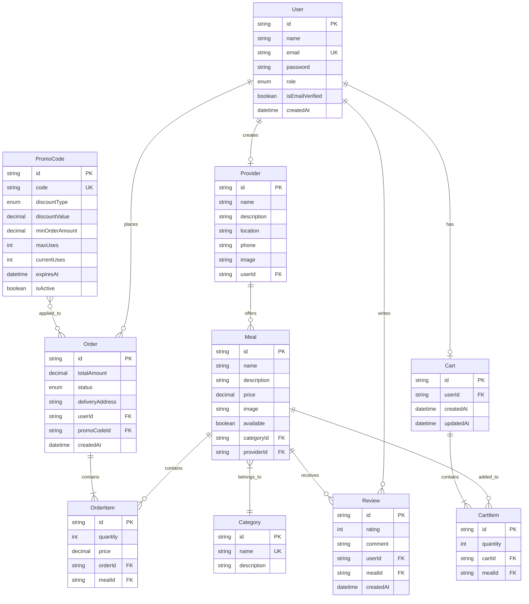
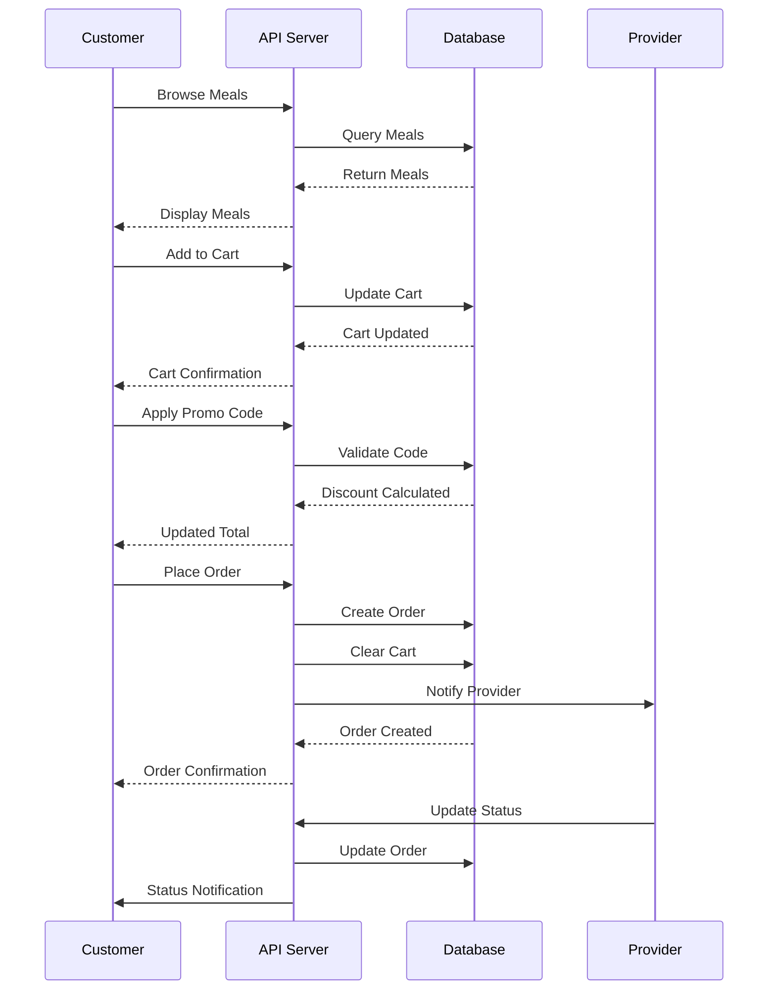
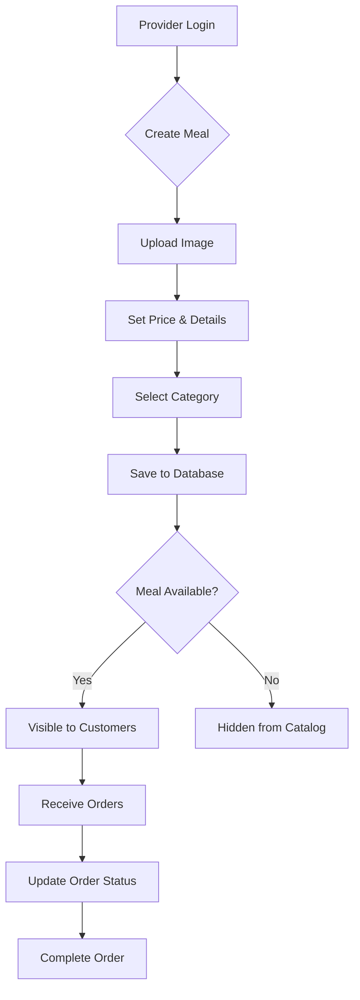

# 🍔 OrderEats Server – Food Delivery Ecosystem

**OrderEats Server** is a robust, scalable backend architecture designed for a modern food delivery platform. It seamlessly connects customers, food providers, and administrators with a focus on real-time performance and data integrity.

---

## 📖 Project Overview

The system manages the entire lifecycle of food delivery—from user authentication and menu management to secure payments and real-time order tracking. This platform creates a digital bridge between local food providers and hungry customers, ensuring a seamless experience for all stakeholders.

### 🎯 Project Objectives

| Objective                  | Description                                                                     |
| :------------------------- | :------------------------------------------------------------------------------ |
| **Digital Bridge**         | Connecting local food providers with hungry customers efficiently               |
| **Streamlined Ordering**   | A frictionless cart and checkout experience                                     |
| **Provider Empowerment**   | Tools for restaurants to manage meals, prices, and order statuses               |
| **Administrative Control** | Comprehensive dashboard for managing users, promo codes, and platform analytics |

---

## 🛠️ Technology Stack

| Layer              | Technology                            | Purpose                                         |
| :----------------- | :------------------------------------ | :---------------------------------------------- |
| **Runtime**        | Node.js                               | High-performance JavaScript runtime             |
| **Framework**      | Express.js (Modular Pattern)          | Lightweight, flexible web framework             |
| **Language**       | TypeScript                            | Type-safe development with enhanced IDE support |
| **Database**       | PostgreSQL                            | Robust relational database with ACID compliance |
| **ORM**            | Prisma                                | Type-safe database client with auto-completion  |
| **Authentication** | JWT (Access & Refresh Token Strategy) | Secure stateless authentication                 |
| **Email Service**  | Nodemailer                            | Transactional email delivery                    |

---

## 🏗️ System Architecture

The server follows a **Modular MVC Architecture** to ensure maintainability and high scalability:

```
┌─────────────────────────────────────────────────────────┐
│                     Client Layer                        │
│          (Mobile App, Web App, Admin Panel)             │
└───────────────────┬─────────────────────────────────────┘
                    │
                    ▼
┌─────────────────────────────────────────────────────────┐
│                  API Gateway (Express)                  │
│              Middleware Layer (Auth, CORS)              │
└───────────────────┬─────────────────────────────────────┘
                    │
                    ▼
┌─────────────────────────────────────────────────────────┐
│                   Business Logic Layer                  │
│    ┌──────────┐  ┌──────────┐  ┌──────────┐           │
│    │  Auth    │  │  Orders  │  │  Meals   │           │
│    │ Module   │  │  Module  │  │  Module  │  ...      │
│    └──────────┘  └──────────┘  └──────────┘           │
└───────────────────┬─────────────────────────────────────┘
                    │
                    ▼
┌─────────────────────────────────────────────────────────┐
│              Data Access Layer (Prisma ORM)             │
└───────────────────┬─────────────────────────────────────┘
                    │
                    ▼
┌─────────────────────────────────────────────────────────┐
│                PostgreSQL Database                      │
│         (Users, Orders, Meals, Carts, etc.)             │
└─────────────────────────────────────────────────────────┘
```

### Architecture Components:

- **Modules**: Each feature (Auth, Order, Meal) is isolated with its own routes, controllers, and services
- **Prisma Layer**: Ensures type-safe database queries and automated migrations
- **Middlewares**: Handles global error management, authentication guards, and request validation

---

## 🚀 Core Features & Requirements

### 🔐 Functional Requirements

| Feature                              | Description                                                          | Implementation                                             |
| :----------------------------------- | :------------------------------------------------------------------- | :--------------------------------------------------------- |
| **Role-Based Access Control (RBAC)** | Dedicated permissions for Customer, Provider, and Admin              | JWT-based middleware with role verification                |
| **Meal Management**                  | Full CRUD operations for providers to manage their digital menu      | RESTful API with image upload support                      |
| **Advanced Cart System**             | Persistent shopping cart with real-time total calculations           | User-specific cart with item quantity management           |
| **Secure Checkout**                  | Integrated order placement with delivery tracking                    | Transaction-safe order creation with status updates        |
| **Promo System**                     | Dynamic discount management with validity checks and usage limits    | Time-based validation with usage tracking                  |
| **Email Notifications**              | Automated emails for verification, password reset, and order updates | Nodemailer integration with HTML templates                 |
| **Authentication Flow**              | Complete auth system with email verification                         | Access/Refresh token strategy with secure password hashing |

---

## 📋 Role Capabilities

### 👤 Customer Role

- ✅ Browse meals by category and provider
- ✅ Manage shopping cart (add, update, remove items)
- ✅ Apply promo codes for discounts
- ✅ Place orders with delivery address
- ✅ Track order status in real-time
- ✅ Write reviews and ratings for meals
- ✅ View order history

### 🏪 Provider Role

- ✅ Create and manage provider profile
- ✅ Manage meal listings (CRUD operations)
- ✅ Upload meal images
- ✅ Update meal availability and pricing
- ✅ View incoming orders
- ✅ Change order status (Pending → Confirmed → Delivered)
- ✅ View sales analytics

### 🛡️ Admin Role

- ✅ Full system oversight
- ✅ User role management
- ✅ Create and manage categories
- ✅ Create and manage promo codes
- ✅ Monitor all orders across the platform
- ✅ View platform analytics
- ✅ Manage provider approvals
- ✅ Customer support capabilities

---

## 🗄️ Database Schema

### Core Entities



---

## 🔒 Security Features

### Authentication & Authorization

- **JWT Strategy**: Dual token system (Access + Refresh)
- **Password Security**: Bcrypt hashing with configurable salt rounds
- **Email Verification**: Required before full account access
- **Password Reset**: Secure token-based reset flow
- **Role-Based Middleware**: Route protection based on user roles

### Data Protection

- **SQL Injection Prevention**: Prisma ORM with parameterized queries
- **CORS Configuration**: Controlled cross-origin requests
- **Environment Variables**: Sensitive data isolated in `.env`
- **Input Validation**: Request body validation middleware
- **Error Handling**: Sanitized error messages (no stack traces in production)

---

## 📊 API Response Standards

### Success Response Format

```json
{
  "success": true,
  "message": "Operation completed successfully",
  "data": {
    // Response payload
  },
  "meta": {
    "page": 1,
    "limit": 10,
    "total": 100
  }
}
```

### Error Response Format

```json
{
  "success": false,
  "message": "Operation failed",
  "errorMessages": [
    {
      "path": "field_name",
      "message": "Detailed error description"
    }
  ],
  "stack": "Error stack trace (development only)"
}
```

### HTTP Status Codes

| Code    | Meaning               | Usage                                   |
| :------ | :-------------------- | :-------------------------------------- |
| **200** | OK                    | Successful GET, PATCH, DELETE           |
| **201** | Created               | Successful POST (resource created)      |
| **400** | Bad Request           | Invalid input data                      |
| **401** | Unauthorized          | Missing or invalid authentication       |
| **403** | Forbidden             | Valid auth but insufficient permissions |
| **404** | Not Found             | Resource doesn't exist                  |
| **409** | Conflict              | Duplicate resource (e.g., email exists) |
| **500** | Internal Server Error | Unexpected server error                 |

---

## 🔄 Business Workflows

### Customer Order Flow



### Provider Meal Management Flow



---

## 🚦 Development Guidelines

### Code Structure Principles

1. **Modular Design**: Each feature is a self-contained module
2. **Separation of Concerns**: Routes → Controllers → Services → Database
3. **DRY Principle**: Shared utilities in `/shared` and `/helpers`
4. **Type Safety**: Leverage TypeScript for compile-time checks
5. **Error Handling**: Centralized error middleware with custom error classes

### Naming Conventions

```typescript
// Files: kebab-case
auth.routes.ts;
user.controller.ts;

// Classes/Interfaces: PascalCase
class ApiError extends Error {}
interface IUserService {}

// Functions/Variables: camelCase
const getUserById = () => {};
let isAuthenticated = false;

// Constants: UPPER_SNAKE_CASE
const JWT_SECRET = process.env.JWT_SECRET;
```

---

## 🧪 Testing Strategy

### Unit Testing (Planned)

- Service layer functions
- Utility helpers
- Validation logic

### Integration Testing (Planned)

- API endpoints
- Database operations
- Authentication flow

### Testing Tools

- **Jest**: Testing framework
- **Supertest**: HTTP assertions
- **Prisma Test Environment**: Database mocking

---

## 🌐 Deployment Architecture

### Production Environment

```
┌─────────────────────────────────────────┐
│         Load Balancer (Nginx)           │
└────────────┬────────────────────────────┘
             │
    ┌────────┴────────┐
    ▼                 ▼
┌─────────┐      ┌─────────┐
│ Server  │      │ Server  │
│ Instance│      │ Instance│
│   #1    │      │   #2    │
└────┬────┘      └────┬────┘
     │                │
     └────────┬───────┘
              ▼
      ┌──────────────┐
      │  PostgreSQL  │
      │   Database   │
      └──────────────┘
```

### Deployment Platforms

- **Vercel**: Serverless deployment with auto-scaling
- **Railway**: Container-based deployment
- **Heroku**: Platform-as-a-Service (PaaS)
- **DigitalOcean**: VPS deployment
- **AWS EC2**: Full infrastructure control

---

## 📈 Performance Optimizations

### Database Optimizations

- **Indexed Fields**: Email, user IDs, order dates
- **Query Optimization**: Prisma includes for related data
- **Connection Pooling**: Managed by Prisma

### API Optimizations

- **Pagination**: Limit results for large datasets
- **Caching Strategy**: Redis for frequently accessed data (future)
- **Compression**: Gzip middleware for responses
- **Rate Limiting**: Prevent API abuse (future)

---

## 🔮 Future Enhancements

### Planned Features

- [ ] Real-time order tracking with WebSockets
- [ ] In-app chat between customers and providers
- [ ] Advanced search with filters and sorting
- [ ] Loyalty points and rewards system
- [ ] Multi-language support (i18n)
- [ ] Analytics dashboard for providers
- [ ] Push notifications (FCM integration)
- [ ] Payment gateway integration (Stripe/PayPal)
- [ ] Delivery driver management module
- [ ] Advanced reporting and insights

---

## 📞 Support & Contact

**Developer**: Emtiaz Ahmed  
**Project Repository**: [GitHub - OrderEats Server](https://github.com/Emtiaz-ahmed-13/ordereeats_server)  
**Email**: emtiazahmed13@example.com

---

## 📄 License

This project is licensed under the **MIT License**.

---

**Last Updated**: February 2026  
**Version**: 1.0.0
